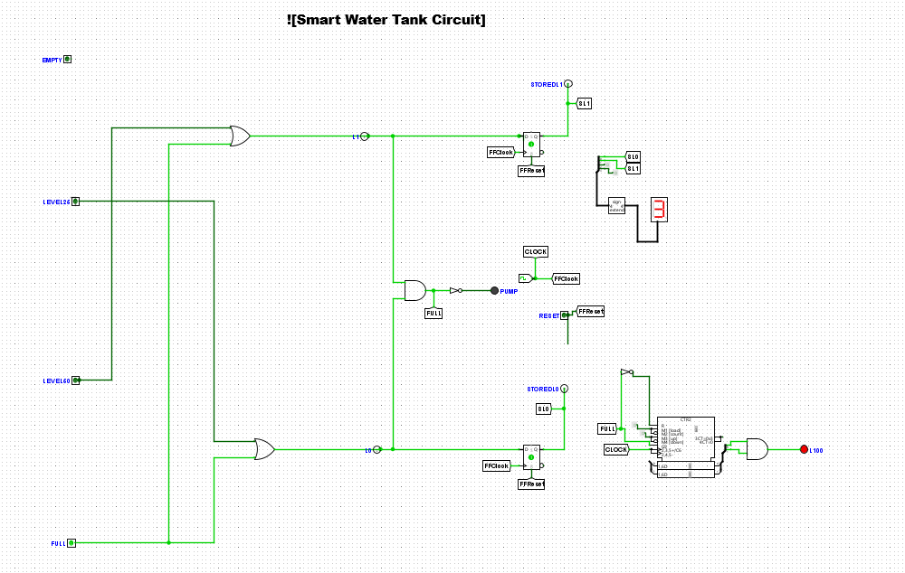

# Smart Water Tank Monitoring and Control System

This project implements a digital logic system for monitoring and controlling a water tank.

## Contents
- `IFT211_LabAssessment_Lateef.pdf` → Full report with Boolean derivations, truth tables, K‑Maps, and testing scenarios.
- `TankSystem.circ` → Logisim circuit file for the smart water tank system.
- `circuit.png` → Screenshot of the Logisim circuit.

## Features
- Pump control logic
- Alarm system
- Register for tank level
- Truth tables and K‑Map simplifications
- Testing scenarios at 0%, 25%, 50%, and 100% tank levels

## Circuit Design

## Notes
- The PDF is the official submission file.
- The `.circ` file can be opened in Logisim for verification.
